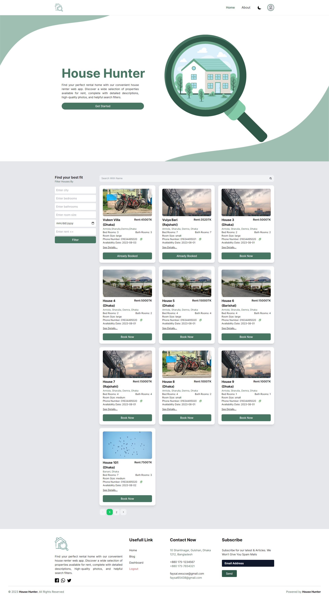

## Valid Palindrome

```jsx
function isPalindrome(str) {
  const formattedStr = str.toLowerCase().replace(/[^a-z0-9]/g, "");
  const reversedStr = formattedStr.split("").reverse().join("");
  return formattedStr === reversedStr;
}
```

# House Hunter


House Hunter is a delightful platform that simplifies the house rental process, connecting house owners with potential renters. It provides a seamless experience for users to list their houses, search for available houses, and make bookings.

## Live Demo

Check out the live demo of House Hunter [here](https://green-house-hunter.netlify.app).

## Features

- **User Registration**: Users can easily register by providing their full name, role (House Owner or House Renter), phone number, email, and password. Custom authentication using JWT and MongoDB is implemented to handle user registration and login.

- **House Owner Dashboard**: Upon successful registration as a House Owner, users are redirected to their personalized dashboard. The dashboard allows House Owners to manage their listed houses and bookings effectively. They can view a list of houses owned by them and perform actions such as adding new houses, editing existing houses, and deleting houses. All required information about the house, including name, address, city, bedrooms, bathrooms, room size, picture, availability date, rent per month, phone number, and description, must be provided.

- **House Renter Dashboard**: House Renters have their unique dashboard where they can manage their bookings. They can easily book houses from the home page by providing their name, email, and phone number. The dashboard displays their current bookings and provides options to remove or delete booked houses.

- **Home Page and House Search**: The home page showcases all the available listed houses. Anyone can search for houses based on their preferences, including city, bedrooms, bathrooms, room size, availability, and rent per month. House Renters must be logged in to book a house. The application implements server-side pagination/infinite scroll to fetch 10 houses at a time, ensuring a smooth browsing experience.

## Technologies Used

- Frontend: React.js, Next.js, Tailwind CSS, Next UI, React Tanstack Query, React Hook Form
- Backend: Node.js, Express.js
- Database: MongoDB

## Getting Started

To run House Hunter locally, follow these steps:

1. Clone the repository: `git clone <repository-url>`
2. Navigate to the project directory: `cd house-hunter`
3. Install the dependencies: `npm install`
4. Set up the environment variables by creating a `.env` file based on the provided `.env.example` file.
5. Start the development server: `npm run dev`
6. Open the application in your browser: `http://localhost:3000`

## Screenshots

### Home Page



### House Owner Dashboard


## Contributing

Contributions to House Hunter are welcome! If you find any issues or want to add new features, feel free to submit a pull request.

## License

This project is licensed under the MIT License. See the [LICENSE](./LICENSE) file for more information.

## Contact

For any inquiries or feedback, please contact us at househunter@example.com.

---

Thank you for choosing House Hunter! We hope you enjoy finding your dream home with ease.
